# Problem
Thanks to easily accessible online cookbooks, home cooks from all around the country are able to quickly and efficiently explore recipes for foods that they've never tried before. However, a consequence of all of these different recipes online is that cooks will see an interesting recipe for a meal from a different culture, but that recipe will contain obscure and hard to obtain ingredients. One example is if one tries to search for a recipe for Bobotie, a South African dish, an essential ingredient to it is Asafoetida. Asafoetida is a plant native to Iran and Afghanistan that it is fairly hard to recognize; let alone buy in a store in Seattle. Perhaps someone from South Africa would recognize it and know where to buy it, but other people who are seeking to appreciate South African food and cook it in their own homes would be lost. In our user research conducted among university students in the greater Seattle area, a majority 90% of participants cooked at home. Out of this majority, 58% of participants cooked food from outside of their culture 3-6+ times a month. Most of these amatuer cooks used Google as a resource to find obscure ingredients, while a second majority asked friends. Doing a quick google search of where to buy Asafoetida in Seattle returns some locations, a couple of moderately related articles, and some reddit posts. The same results appear for most obscure ingredients. Although some locations might appear in the search results, there is no guarantee that those locations will have the exact ingredients. This can leave many users unsure as to where to buy the necessary ingredients. This barrier might be a big enough of an annoyance to deter amatuer chefs from creating and experiencing other cultural cuisines. As of now, there is no directly current solution that fixes this issue of uncertainty.

# Solution
Bonito will be a web application where home cooks can search for where to buy specific ingredients in the Greater Seattle Area. While a range of food products will be represented, the focus will be on providing greater accessibility to ingredients that are harder to come by, such as ingredients unique to a particular culture’s cuisine. Each ingredient will have a list of locations, which will be crowd-sourced. Users can confirm or deny whether they found the ingredient at a given location.

## Click-Through Demonstration
Click [here](https://www.figma.com/proto/0ubqe2G6CiLnbl0GgK7Qce/Bonito-Web-App-Design?node-id=12%3A1882&viewport=322%2C-20%2C0.19504022598266602&scaling=min-zoom) to see a clickable demo of our product.

## Top Navigation Bar
Every page will have a top navigation bar:

Clicking the logo on the left will bring users to the home page (which is also the “Find ingredients” page) Clicking the “Find ingredients” link will bring the user to the home page (same as clicking the logo). Clicking the “About” link will bring the user to the “About” page. Clicking the “Sign In” link will bring the user to the “Sign In” page. If the user is already on that page, the link will be semibold font weight, and clicking it will bring users to the same page.

If the user is already signed in, the “Sign In” link will be replaced with “Signed in as [User’s Name]” Clicking this will expand a submenu, which will have a “Sign Out” link:

Clicking the “Sign Out” link will sign the user out, and the “Signed in as [User’s Name]” will be replaced with the “Sign In” link.

## “Find ingredients” / home page

The site index, or home page, will also be the primary search page:

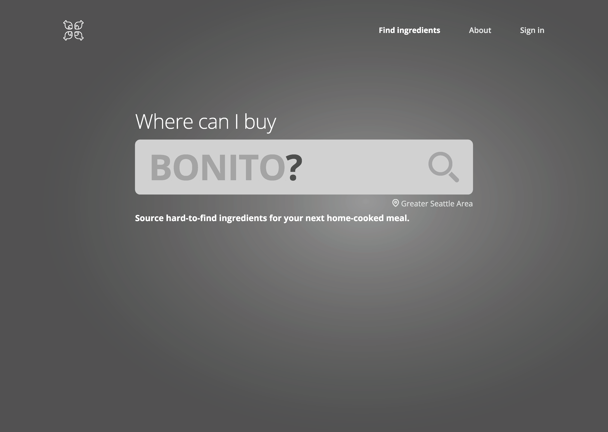

Users click into the large text input field and type the name of the ingredient they are looking for. The blinking type indicator on the left, where the first character will be typed. Once the first character is inputted, the placeholder text “BONITO” will disappear. The question mark character will always follow immediately after the last character typed in the input field. The text in the search field will scroll to the left if the query exceeds the length of the input field, just as it would with a default text input field. The text will begin scrolling before reaching the search icon, such that the icon will never be covered with text. Users can press the Backspace key to delete a character, all the way back to an empty search query.

All search results will be limited to the Greater Seattle Area, and the region cannot be changed.

To submit the search query, users can either press the Enter key on their keyboards or click on the search icon on the right side of the input field.

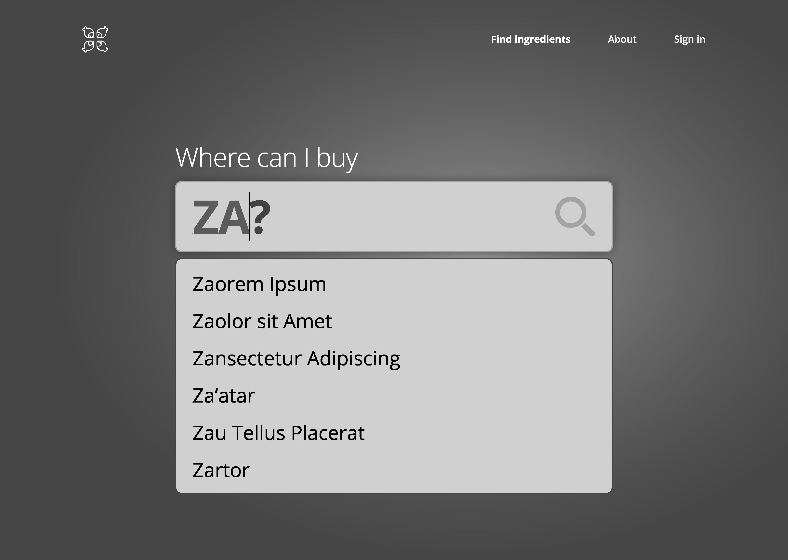

The top 6 search results will appear under the input field as the user types their query. Clicking one of them will take the user to that ingredient’s page.

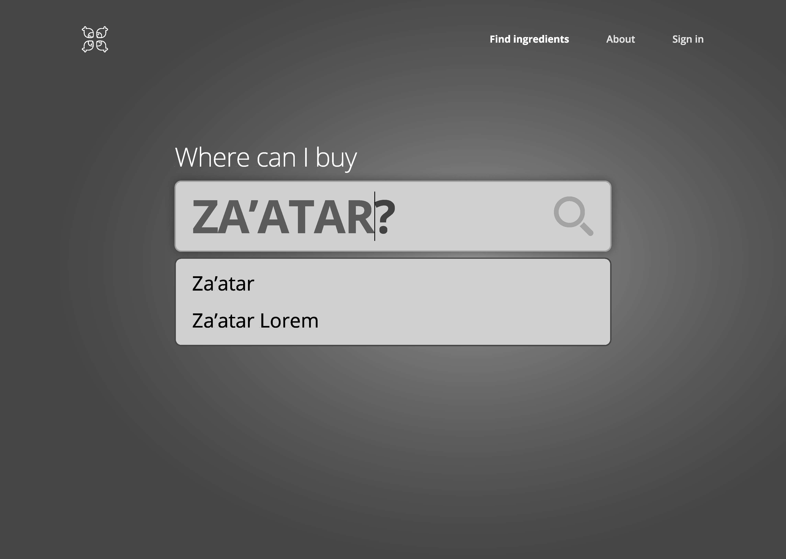

If there are less than 6 search results, all search results will appear.

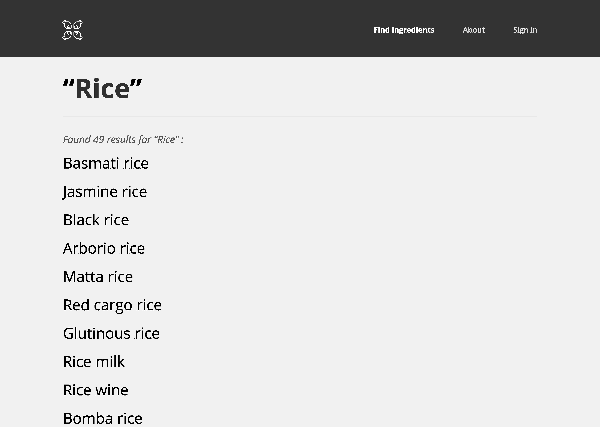

If the user presses the Enter key or clicks the Search icon instead of clicking one of the top 6 results, they will be taken to a search results page. All ingredients matching the user’s query will be listed in alphabetical order. The number of search results will be displayed as “Found [number of results] results for “[search query]” :”

Clicking the “Begin a new search” link will take users back to the “Find ingredients” / home page.

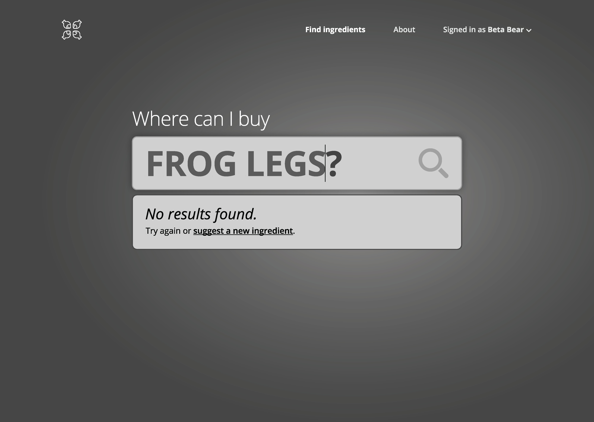

If there are no search results, a message “No results found” will appear.
Users can click the “suggest a new ingredient” link, which will open a modal with a form:

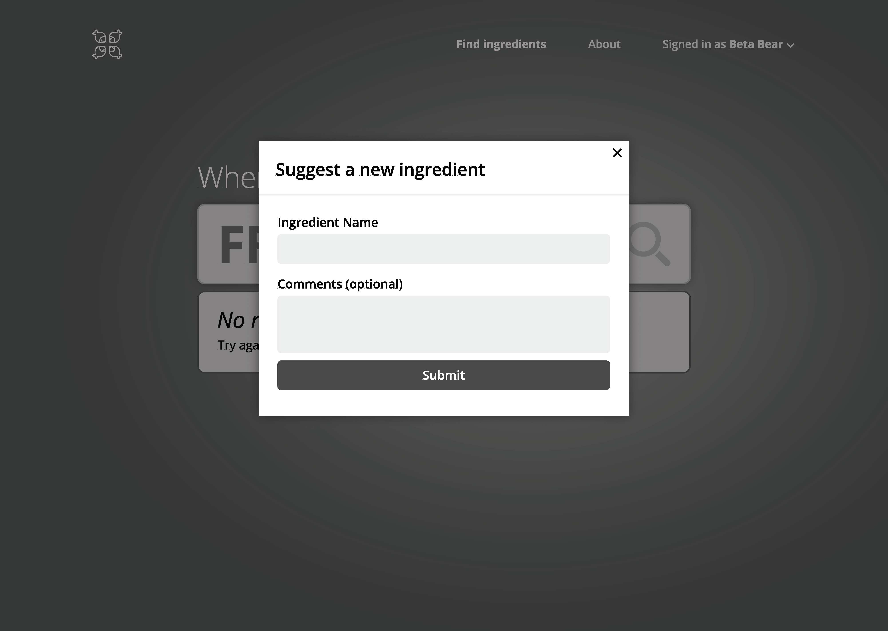

There will be two input fields in the modal form. The first, “Ingredient Name” is required. The second, “Comments (optional)” is not required. Clicking the “X” icon in the top right corner will close the modal. Content behind the modal will remain visible, but all active items not within the modal will be inactive. That content will be darkened with a 30% opacity black background color to bring focus to the modal content.

The active input field will be differentiated with a border and drop shadow. Content inputted will behave as a default input field would behave.

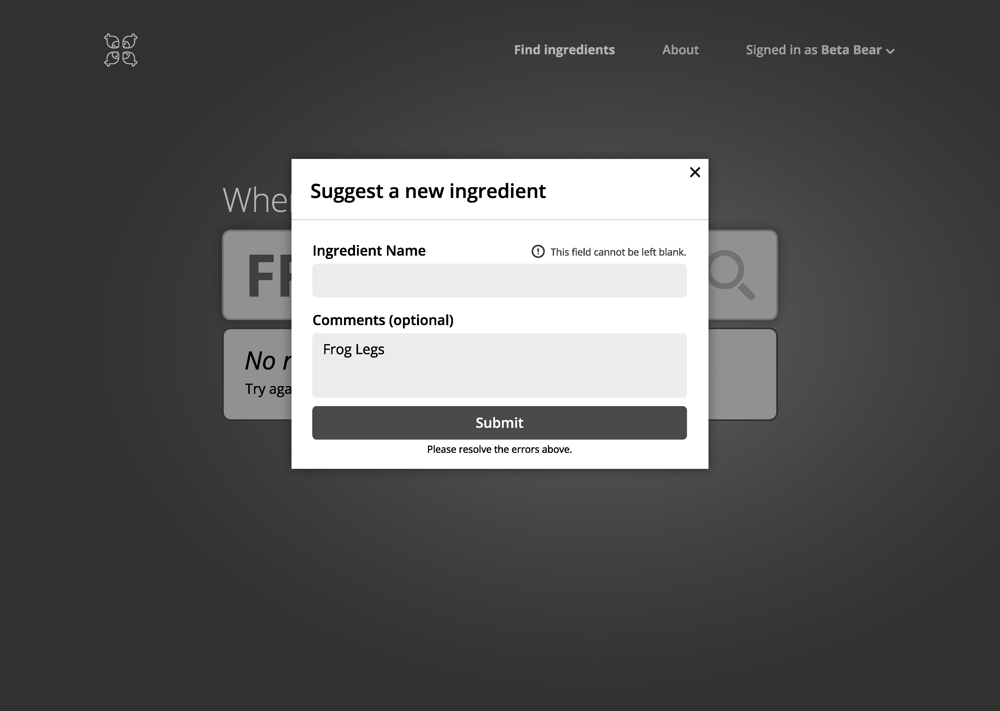

If the user does not fill out the “Ingredient Name” field before submitting, an error message will appear below the Submit button. As well as above the input field on the right side.

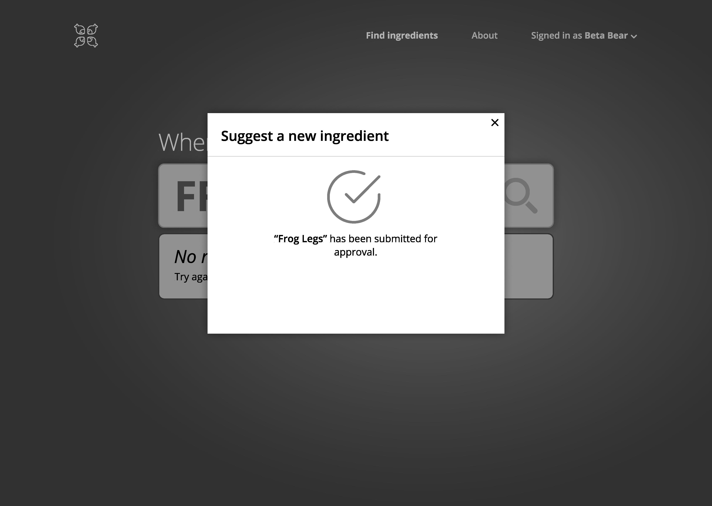

Once the the form has been submitted, this confirmation message will appear. The suggested new ingredient will not be added to the database until it has been approved by the site administrators.

## Ingredient-specific page

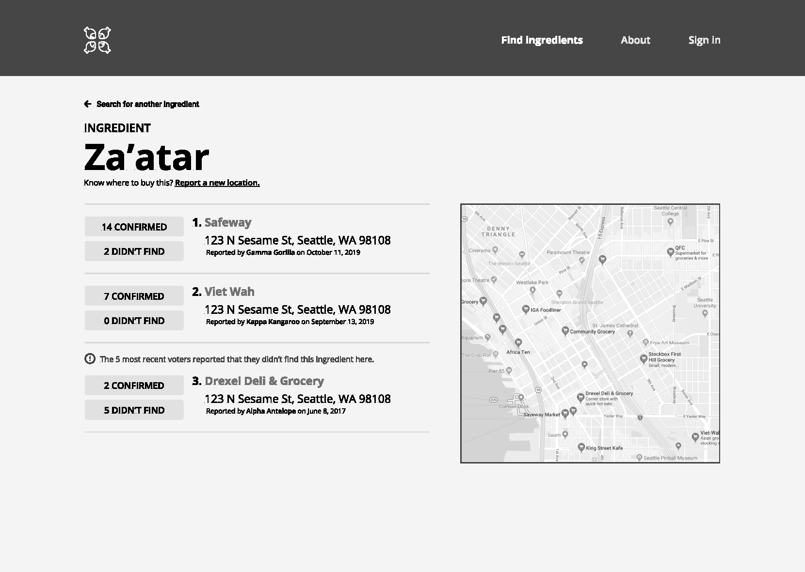

Once the user clicks one of the search results, they will be taken to that ingredient’s page. Clicking the “Search for another ingredient” link will take the user back to the “Find ingredients” page.

Locations will be listed in order of most “Confirmed”. Each location entry has the following features:
- “Confirmed” and “Didn’t Find” buttons - If users are signed in, they can click either “Confirmed” or “Didn’t Find” for each location. Clicking the button will increase the count displayed on the button. Other users will see these counts increase in real time.

- Numbered location name - the number is the order in the list, displayed in order. The name is the name of the location.
- Address - this is the location’s address. All address data is standardized using Google’s mapping algorithms.
The location data fetched from a map can be converted from geographic coordinates into human-readable address through Leaflet. Leaflet Control Geocoder plugin in Leaflet can be used for both geocoding and reverse geocoding, and supports MapBox and Google as well. 
- Submission info - follows the format “Reported by [User Name] on [Date Reported]”.
- Alert - if the 5 most recent voters reported that they “Didn’t Find” the ingredient at the location, this alert will appear at the top of the location entry, “The 5 most recent voters reported that they didn’t find this ingredient here.”

All locations will also be marked on a map on the right side of the page. 
Leaflet can be used to displayed marked points. By getting location information (latitude & longitude) from our database, locations will be marked on the map. Leaflet also has Layer Groups where several layers for different locations can be grouped to one same map.

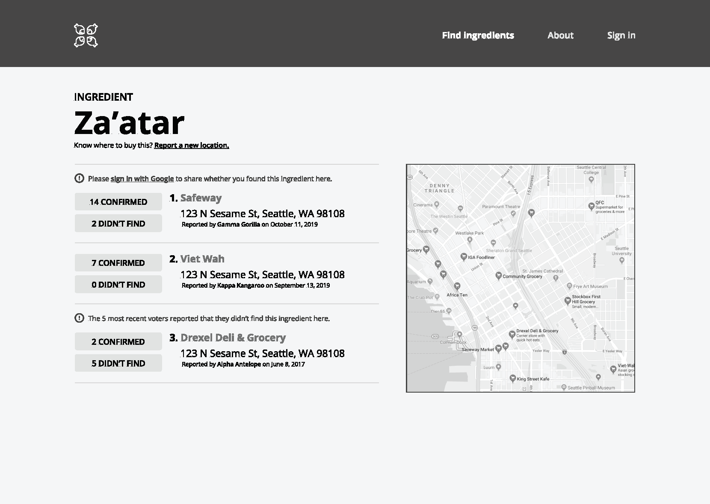

If a user attempts to vote “Confirmed” or “Didn’t Find” for an entry before first signing in, an error message will appear: “Please sign in with Google to share whether you found this ingredient here.” Clicking the “sign in with Google” link will take the user to the Sign In page.

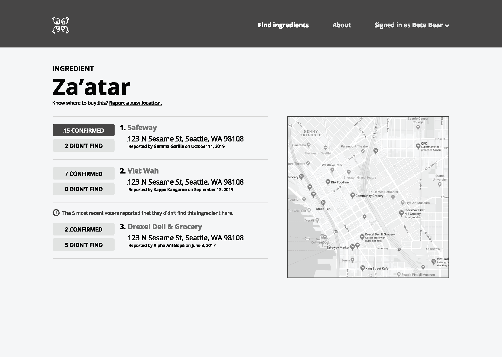

Once the user is signed in, they can vote whether they found the ingredient by clicking “Confirmed” or “Didn’t Find” for each location. For each location, users can only vote “Confirmed” OR “Didn’t Find”. The option selected will be indicated by the dark background. Clicking the previously selected button again will remove the vote. Clicking the other button will remove the previous vote and add the vote to the button clicked. In other words, the “Confirmed” and “Didn’t Find” buttons will operate the same way that “upvote” and “downvote” buttons work on other sites.

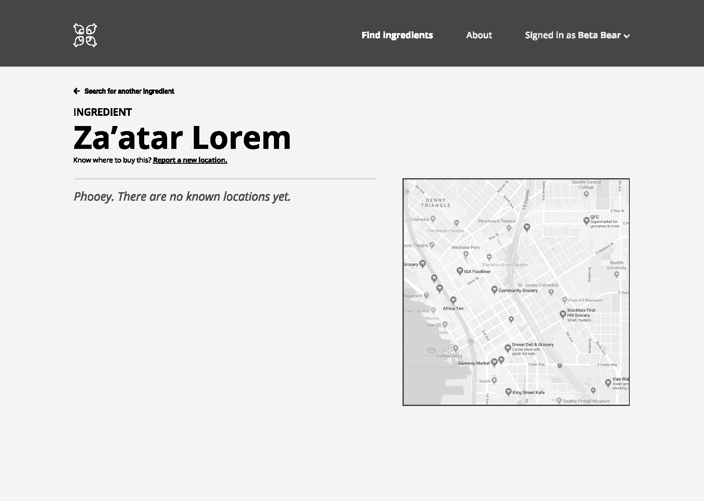

If there are no location entries, the message “Phooey. There are no known locations yet” will appear instead.

Clicking the “report a new location” link will open a modal:

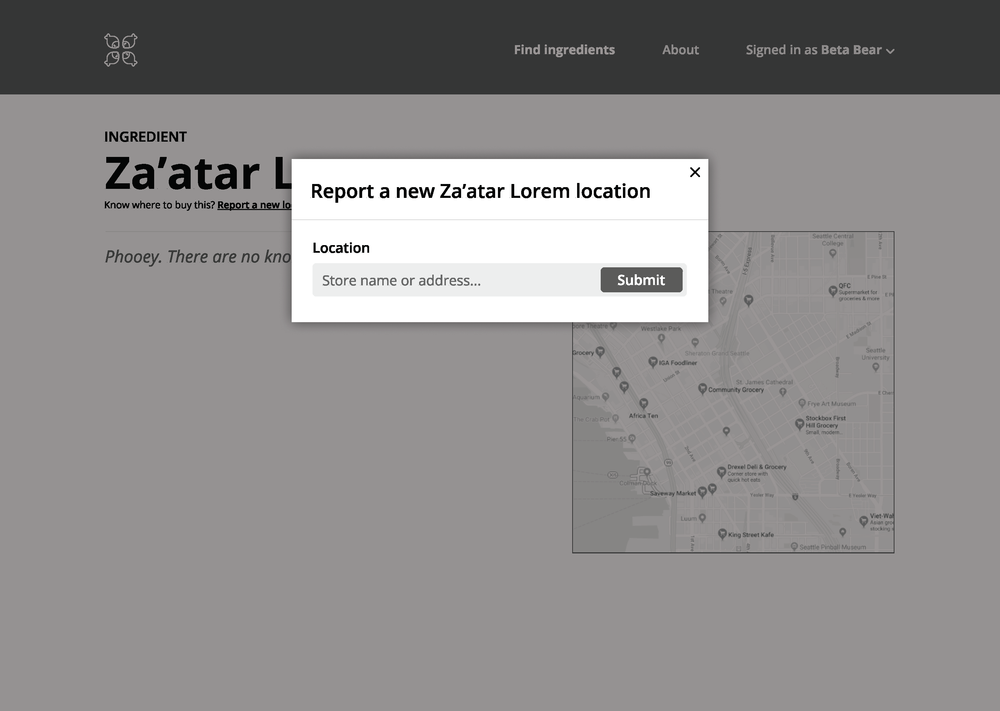

Clicking the “X” icon in the top right corner will close the modal. Content behind the modal will remain visible, but all active items not within the modal will be inactive. That content will be darkened with a 30% opacity black background color to bring focus to the modal content.

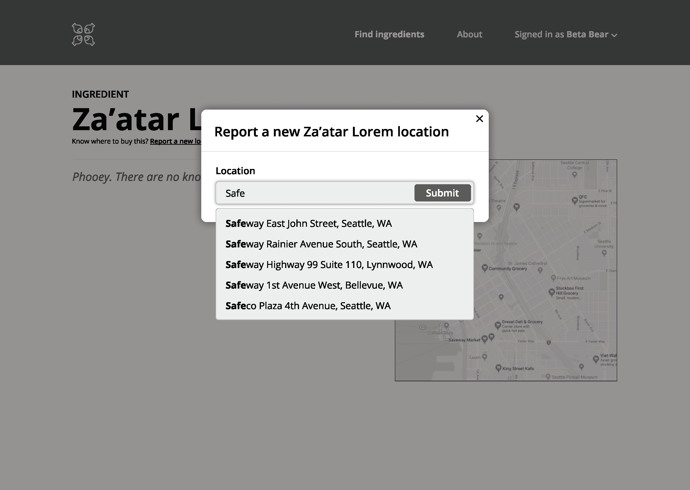

The active input field will be differentiated with a border and drop shadow. Content inputted will behave as a default input field would behave. The top 5 search results will appear as the user types the location name or address. If there are less than 5 results, all search results will appear.

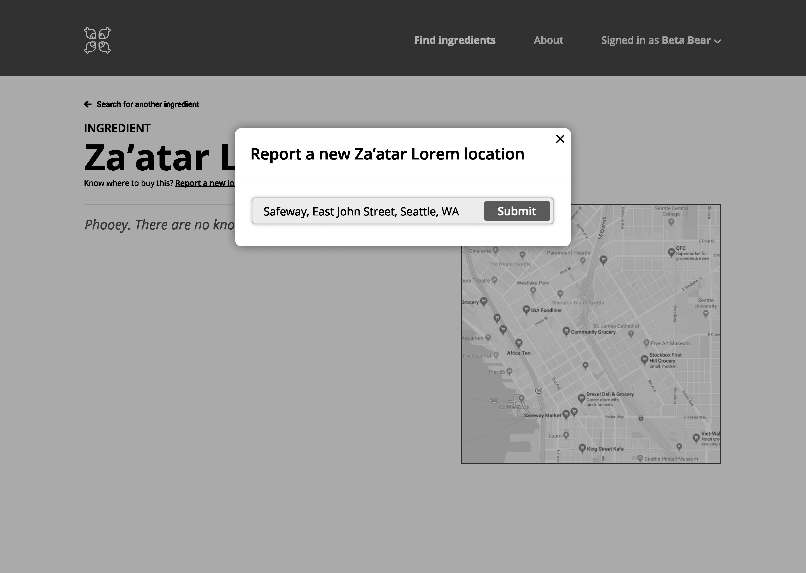

Clicking one of them will fill the input field with the remaining address information. We will be using the Google Maps API to manage location data. Users will be authenticated through Firebase’s Authentication SDK. Basic information such as their name, and email will be stored. The Firebase authentication SDK provides email and password authentication as well as methods that allow users to sign in with their Google or Facebook accounts. This way, only valid addresses can be submitted.

Users click the “Submit” button to report a new location for that ingredient.

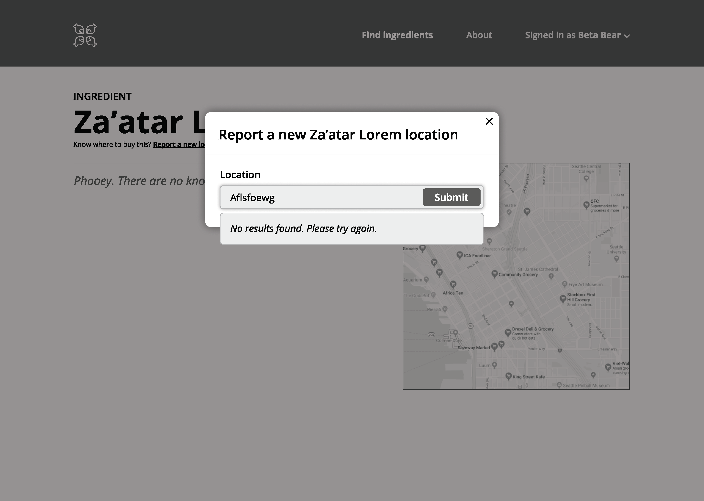

If there are no results, the message “No results found. Please try again” will appear. 

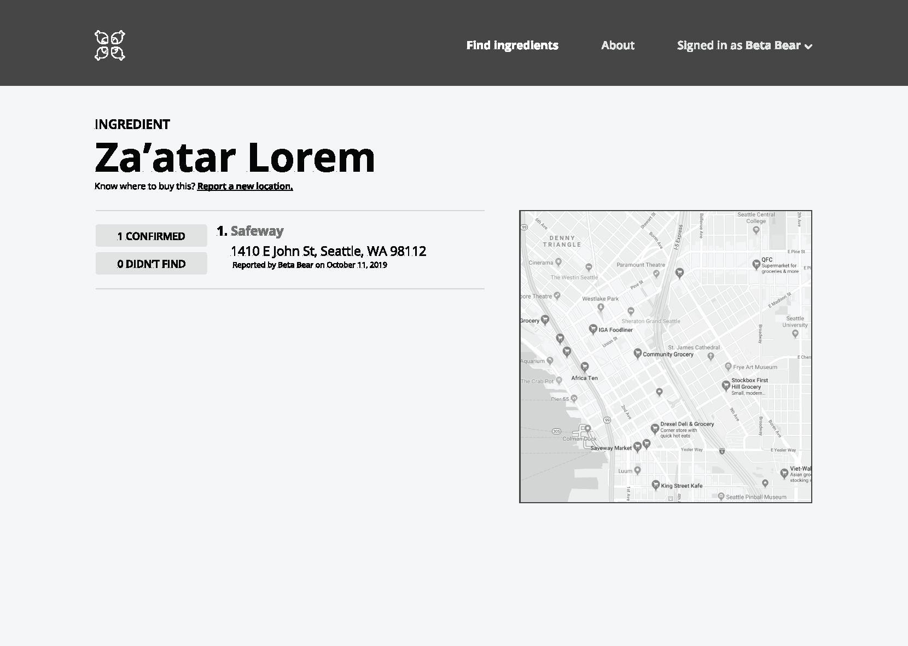

Once the user clicks the “Submit” button, the modal will close, and a new location entry will be generated and displayed. That location entry will by default have a count of 1 for “Confirmed”. A pin with the new location will be added to the map. Other users may vote whether they found the ingredient at that location.

## Sign in

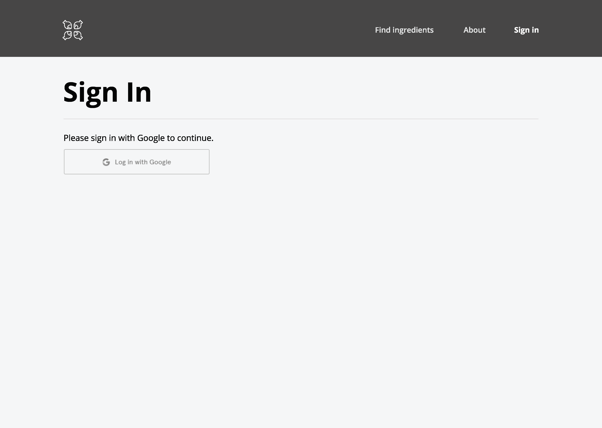

Sign in will be conducted using Google’s single sign-on. Leaflet Control Geocoder plugin can be used for reverse geocoding. When there is an error message indicating nothing was found or that a geocoding error occurred, the addresses will be considered invalid and in that way, the addresses cannot be submitted. 

Users can click the “Log in with Google” button, after which they will be prompted through Google’s account sign in process. Once they have completed the sign in process, they will return to the Bonito site to continue.

Clicking the “Back to [Previous Page’s Name]” link will take the user to the page they were previously at.

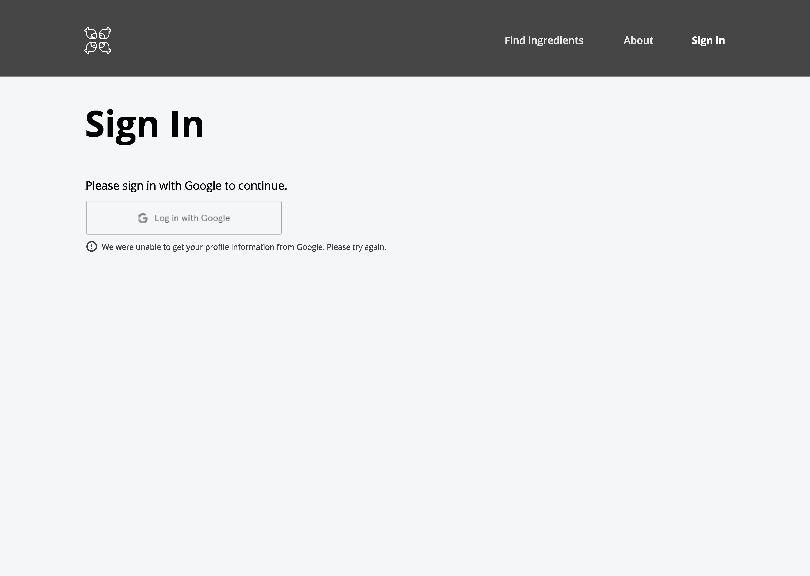

If the Google sign in process fails, the error message “We were unable to get your profile information from Google. Please try again.” will appear below the sign in button.

## About page

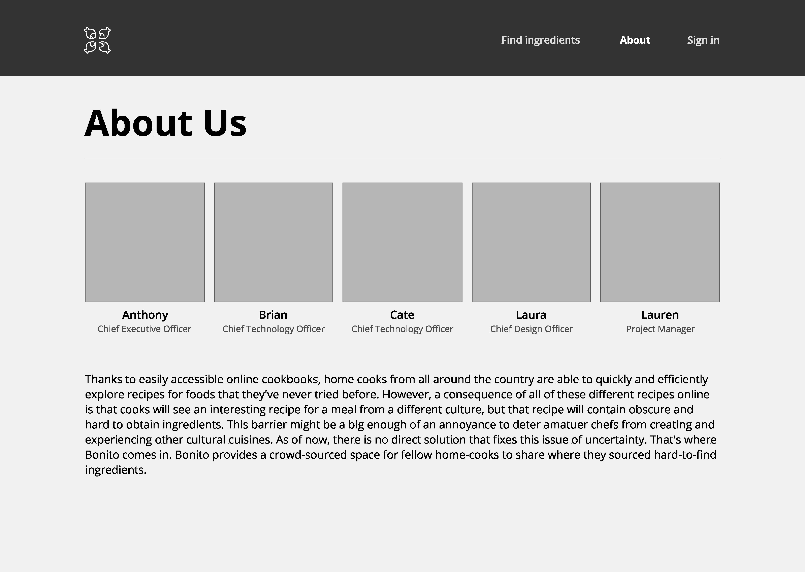

The “About Us” page will have pictures, names, and roles of the project team members, as well as a paragraph description of the project and the problem it solves.

Clicking the “Back to home” link will take users to the “Find ingredients” / home page.
